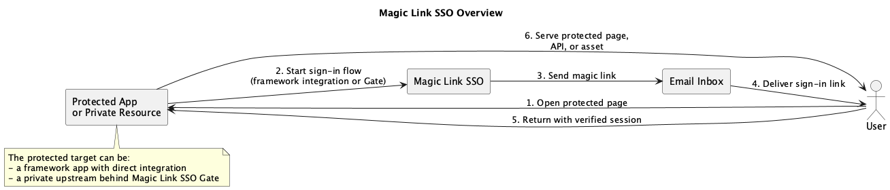
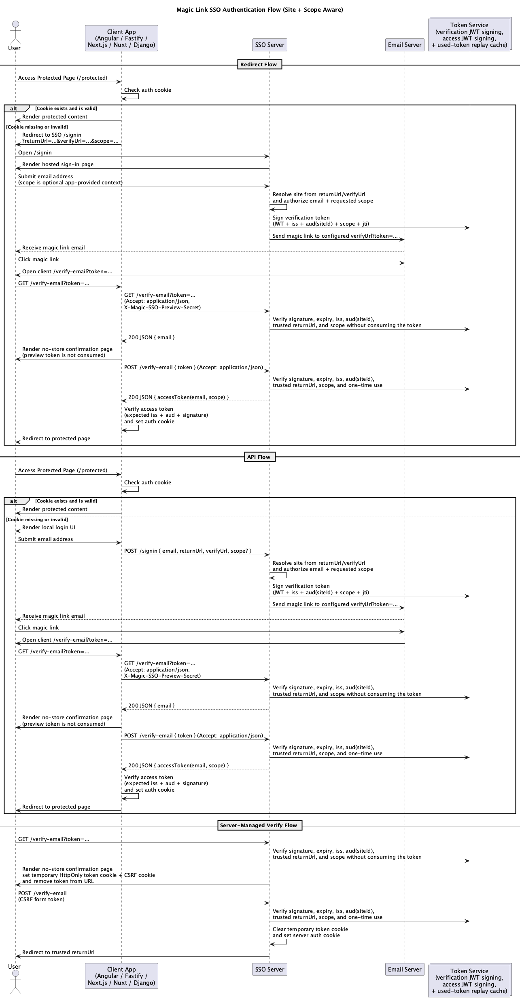

# Magic Link SSO

Passwordless sign-in for self-hosted apps.

Magic Link SSO is a self-hosted email-based SSO server for small private
deployments. It sends time-limited magic links, issues JWT session tokens, and
can run without a database.

This repository contains the server, reusable framework packages, the Magic Link
SSO Gate reverse-proxy service, and example apps for Angular, Django, Fastify,
Next.js, and Nuxt, plus two Gate-backed private resources: `private1` as a
dynamic upstream example and `private2` as a static site example. See
[Magic Link SSO Gate](#magic-link-sso-gate).

## At a Glance

<picture>
  <source media="(prefers-color-scheme: dark)" srcset="./docs/MagicLinkSSO_Overview_dark.png">
  <source media="(prefers-color-scheme: light)" srcset="./docs/MagicLinkSSO_Overview_light.png">
  
</picture>

Magic Link SSO can protect private resources in two high-level ways:

- framework integration: the app owns the callback and session handling
- Gate reverse proxy: Gate owns the callback and protects a private upstream

In both cases, access is granted through email-based magic links rather than
passwords or HTTP Basic Auth.

## Contents

- [How it works](#how-it-works)
- [Getting Started](#getting-started)
- [Configuration Reference](#configuration-reference)
- [Framework Integrations](#framework-integrations)
- [Magic Link SSO Gate](#magic-link-sso-gate)
- [Security Considerations](#security-considerations)
- [Contributing](#contributing)
- [License](#license)

## How it works

<picture>
  <source media="(prefers-color-scheme: dark)" srcset="./docs/MagicLinkSSO_Flow_dark.png">
  <source media="(prefers-color-scheme: light)" srcset="./docs/MagicLinkSSO_Flow_light.png">
  
</picture>

Participants:

- User
- Client app (Angular, Fastify, Next.js, Nuxt, or Django)
- SSO server
- Email server
- Token service

Flows:

1. Redirect flow: the client checks its auth cookie and redirects
   unauthenticated users to the hosted `/signin` page. The SSO server resolves
   the target site, checks access rules, signs a one-time verification token,
   and emails the magic link. The client exchanges that verification token for
   an access token and stores the auth cookie.
2. API flow: the client renders its own login form and posts
   `{ email, returnUrl, verifyUrl, scope? }` to the SSO server. The remaining
   flow is the same as the redirect flow.
3. Server-managed verify flow: the built-in hosted `/verify-email` page lands on
   a no-store confirmation page that stores the email token in a temporary
   `HttpOnly` cookie, removes it from the URL, and completes sign-in with
   `POST /verify-email` before redirecting back to the trusted return URL.

## Getting Started

### Try the server with Docker

1. Create a local config file such as `magic-sso.toml`:

    ```toml
    [server]
    appPort = 3000
    appUrl = "http://localhost:3000"
    logLevel = "info"
    logFormat = "pretty"
    serveRootLandingPage = true
    trustProxy = false
    verifyTokenStoreDir = "/tmp/magic-sso/verification-tokens"
    signInEmailRateLimitStoreDir = "/tmp/magic-sso/signin-email-rate-limit"

    [server.securityState]
    # Keep "file" for a single instance. Switch to "redis" so replay
    # protection and sign-in throttling stay enforced across multiple nodes.
    adapter = "file"
    # redisUrl = "redis://127.0.0.1:6379/0"
    keyPrefix = "magic-sso"

    [auth]
    jwtSecret = "replace-me-with-a-long-random-jwt-secret"
    jwtExpiration = "1h"
    csrfSecret = "replace-me-with-a-different-long-random-csrf-secret"
    emailSecret = "replace-me-with-a-different-long-random-email-secret"
    previewSecret = "replace-me-with-a-different-long-random-preview-secret"
    emailExpiration = "15m"

    [cookie]
    name = "magic-sso"
    httpOnly = true
    sameSite = "lax"
    secure = false

    [email]
    from = "owner@example.com"
    signature = "Magic Link SSO"

    [email.smtp]
    host = "smtp.example.com"
    port = 587
    user = "smtp-user"
    pass = "smtp-password"
    secure = false

    [[sites]]
    id = "local"
    origins = ["http://localhost:8080"]
    allowedRedirectUris = ["http://localhost:8080/verify-email", "http://localhost:8080/*"]
    allowedEmails = ["you@example.com"]
    ```

2. Create a matching `.env` file:

    ```env
    MAGICSSO_CONFIG_FILE=./magic-sso.toml
    ```

3. Start the container:

    Shortest option:

    ```sh
    curl -fsSL https://raw.githubusercontent.com/magic-link-sso/magic-sso/main/server/docker-compose.yml | docker compose -f - up
    ```

    Equivalent `docker run` command:

    ```sh
    docker run -it \
      -p 3000:3000 \
      -e MAGICSSO_CONFIG_FILE=/config/magic-sso.toml \
      -v "$(pwd)/magic-sso.toml:/config/magic-sso.toml:ro" \
      --name magic-sso \
      ghcr.io/magic-link-sso/magic-sso/server:latest
    ```

4. Check that the server is up:

    ```sh
    curl http://localhost:3000/healthz
    ```

5. For a full sign-in flow, connect one of the example apps or your own app and
   point it at `http://localhost:3000`.

### Run from source

Prerequisites:

- Node.js 24.15.0 or later
- pnpm 10.30.3 or later
- Python 3.12 or later
- uv 0.10 or later
- Docker if you want to use `server/docker-compose.yml`

Repository layout:

- `server/` SSO server
- `examples/` example apps for Angular, Django, Fastify, Next.js, and Nuxt
- `packages/` reusable framework integrations
- `docs/` supporting documentation and diagrams

1. Clone the repository:

    ```sh
    git clone https://github.com/magic-link-sso/magic-sso.git
    cd magic-sso
    ```

2. Install dependencies:

    ```sh
    pnpm install
    ```

3. Sync the Python environments:

    ```sh
    pnpm python:sync
    ```

4. Copy [`server/magic-sso.example.toml`](./server/magic-sso.example.toml) to a
   real config file, for example `server/magic-sso.toml`, and update the
   secrets, SMTP settings, and `[[sites]]` entries.

5. Point `MAGICSSO_CONFIG_FILE` at that TOML file. `dotenv` is only used for
   this bootstrap step, so a small `server/.env` is enough:

    ```env
    MAGICSSO_CONFIG_FILE=./server/magic-sso.toml
    ```

6. Start the server:

    ```sh
    pnpm dev:server
    ```

    Or with Docker Compose from the repository root:

    ```sh
    docker compose -f server/docker-compose.yml up
    ```

### Development Shortcuts

From the repository root:

```sh
pnpm dev:server
pnpm dev:angular
pnpm dev:angular:package
pnpm dev:fastify
pnpm dev:nextjs
pnpm dev:nextjs:package
pnpm dev:nuxt
pnpm dev:nuxt:package
pnpm dev:django
pnpm dev:private1
pnpm dev:private2
pnpm test:e2e
```

Example app `.env` files act as local defaults. Exported shell variables still
win, so you can switch modes without editing files, for example:

```sh
MAGICSSO_DIRECT_USE=true pnpm dev
```

`MAGICSSO_DIRECT_USE=1` is also supported, but `true` and `false` remain the
recommended forms in docs and scripts.

`pnpm test:e2e` runs the Playwright smoke suite against the bundled example apps
and starts the local SMTP sink and SSO server for the run.

To watch the flow interactively, run `pnpm test:e2e:ui`. You can slow it down
with `PW_SLOWMO_MS`, for example:

```sh
PW_SLOWMO_MS=1200 pnpm test:e2e:ui
```

## Configuration Reference

The server reads its runtime config from the TOML file referenced by
`MAGICSSO_CONFIG_FILE`. Client integrations keep their own env-based settings.

Jump to: [Server TOML](#server-toml) | [Hosted Auth Pages](#hosted-auth-pages) |
[Framework Integrations](#framework-integrations)

### Server TOML

Top-level tables:

- `[server]` sets `appUrl`, `appPort`, `logLevel`, `logFormat`,
  `serveRootLandingPage`, `trustProxy`, `verifyTokenStoreDir`, and
  `signInEmailRateLimitStoreDir`.
- `[server.securityState]` selects whether replay protection and per-email
  sign-in throttling use local files or shared Redis state.
- `[auth]` sets `jwtSecret`, `jwtExpiration`, `csrfSecret`, `emailSecret`, and
  `emailExpiration`.
- `[cookie]` sets cookie name and flags.
- `[email]`, `[email.smtp]`, and `[[email.smtpFallbacks]]` configure delivery.
- `[rateLimit]` sets `windowMs`, `healthzMax`, `signInEmailMax`, `signInMax`,
  `signInPageMax`, and `verifyMax`.
- `[hostedAuth.copy]` and `[hostedAuth.branding]` customize the built-in hosted
  pages.
- `[[sites]]` defines one or more application sites handled by the same SSO
  server.

`server.logFormat` accepts `"json"` for structured logs and `"pretty"` for
human-friendly local output. If omitted, it defaults to `"json"`.

`server.serveRootLandingPage` defaults to `true`. Set it to `false` if Magic
Link SSO should return a normal 404 for `GET /` and your reverse proxy, ingress,
or separate frontend should own the site root instead.

`server.securityState.adapter` defaults to `"file"`, which is appropriate for a
single Magic Link SSO server instance. In multi-instance deployments, set
`server.securityState.adapter = "redis"` and configure
`server.securityState.redisUrl` so verification-token replay prevention and
per-email sign-in throttling are enforced cluster-wide. `keyPrefix` is optional
and defaults to `"magic-sso"`.

Each `[[sites]]` entry must define:

- `id`
- `origins`
- `allowedRedirectUris`
- `allowedEmails`, `[[sites.accessRules]]`, or both

`allowedEmails` remains a shorthand for full-access users and grants the special
`*` scope. `[[sites.accessRules]]` can grant narrower per-email scopes:

```toml
[[sites]]
id = "gallery"
origins = ["https://gallery.example.com"]
allowedRedirectUris = ["https://gallery.example.com/verify-email", "https://gallery.example.com/app/*"]
allowedEmails = ["owner@example.com"]

[[sites.accessRules]]
email = "curator@example.com"
scopes = ["album-A", "album-B"]
```

`allowedRedirectUris` accepts absolute `http(s)` URLs. Use an exact callback
path such as `https://gallery.example.com/verify-email` for `verifyUrl`, and
optionally use a strict sub-path rule ending in `/*` such as
`https://gallery.example.com/app/*` for `returnUrl` targets. Avoid broad
root-level wildcards unless you intentionally trust every route on that origin.

Optional per-site hosted-page overrides live under:

- `[sites.hostedAuth.copy]`
- `[sites.hostedAuth.branding]`

Site routing rules:

- `/signin` resolves the active site from the `returnUrl` origin when present
- if `returnUrl` is absent, it falls back to the `verifyUrl` origin
- `/signin` accepts an optional `scope` string; omitted or blank scopes default
  to `*`
- users granted `*` may request any explicit scope; requesting `*` itself still
  requires a `*` grant
- verification tokens carry `siteId`, so `/verify-email` stays pinned to the
  originating site
- access tokens carry the granted `scope`, the resolved `siteId`, the allowed
  site origins in `aud`, and the Magic Link SSO server origin in `iss`, so
  client integrations can reject tokens minted for another site

Upgrading to the site-bound access-token format invalidates older session
cookies. Existing users need to complete sign-in again after deployment.

See [`server/magic-sso.example.toml`](./server/magic-sso.example.toml) for the
canonical config shape.

### Hosted Auth Pages

The server can render hosted sign-in and verification pages, plus an optional
root landing page. Customize the hosted auth pages with:

- `[hostedAuth.copy]` changes page text such as titles, labels, help text, and
  browser-only feedback messages.
- `[hostedAuth.branding]` changes brand title, logo, support links, and a small
  set of safe CSS variables.
- `[sites.hostedAuth.*]` lets individual sites override those shared defaults.

Hosted HTML security defaults:

- hosted page responses send nonce-based CSP, `X-Frame-Options: DENY`,
  `X-Content-Type-Options: nosniff`, `Referrer-Policy: no-referrer`, and a
  restrictive permissions policy
- browser form posts to `/signin` and `/verify-email` are protected with
  stateless CSRF tokens; JSON API clients do not need to send them
- the default server path uses the file-backed verification replay store; the
  in-memory helper is only intended for tests and embedded use and now emits a
  warning because it does not survive process restarts
- HSTS is added only for HTTPS requests, so configure `trustProxy` correctly
  when TLS is terminated by a reverse proxy

For the full field reference, examples, and validation rules, see
[Hosted Auth Pages](docs/hosted-auth-pages.md).

## Framework Integrations

Across frameworks, client integrations usually need:

- the SSO server URL
- the JWT secret used by the server
- cookie settings that match the server, especially cookie name and path
- an optional direct-use mode if you want to send users straight to the hosted
  `/signin` page instead of a local login page

Framework-specific setup lives in the package and example READMEs:

- Angular: [package](./packages/angular/README.md),
  [example](./examples/angular/README.md)
- Django: [package](./packages/django/README.md),
  [example](./examples/django/README.md)
- Fastify: [example](./examples/fastify/README.md)
- Next.js: [package](./packages/nextjs/README.md),
  [example](./examples/nextjs/README.md)
- Nuxt: [package](./packages/nuxt/README.md),
  [example](./examples/nuxt/README.md)

## Magic Link SSO Gate

For non-SSR apps, static sites, or unknown upstream stacks, use the
[`gate/`](./gate/README.md) service as a reverse proxy in front of the private
resource instead of embedding Magic Link SSO directly into the app.

Gate:

- reserves `/_magicgate/*` for its own auth/session routes
- validates the returned JWT locally before proxying traffic
- protects HTML, assets, API routes, SSE, and websocket upgrades
- works best in a `private.example.com` + `sso.example.com` deployment
- includes `private1` as a dynamic upstream example for HTML, API, SSE, and
  websocket traffic behind Gate
- includes `private2` as a static site example for `index.html`, SPA bundles,
  and plain assets behind Gate
- reads runtime settings from `gate/magic-gate.toml`
- uses `gate/.env.example` only as Docker Compose bootstrap input for the local
  stack, not as Gate runtime config
- ships a dev Docker stack that renders Gate TOML files before startup and uses
  `private1.localhost`, `private2.localhost`, and `sso.localhost`

Quick start:

```sh
cp gate/magic-gate.example.toml gate/magic-gate.toml
MAGIC_GATE_CONFIG_FILE="$PWD/gate/magic-gate.toml" pnpm dev:gate
```

Or with the bundled Docker stack:

```sh
cp gate/.env.example gate/.env
docker compose --env-file gate/.env -f gate/docker-compose.yml up --build
```

Then open:

- `http://private1.localhost:4306`
- `http://private2.localhost:4306`
- `http://sso.localhost:4306`
- `http://localhost:8025` for Mailpit

For a standalone production-style Gate deployment that assumes your SSO server
already exists elsewhere:

```sh
cp gate/magic-gate.example.toml gate/magic-gate.toml
cp gate/.env.prod.example gate/.env.prod
docker compose --env-file gate/.env.prod -f gate/docker-compose.prod.yml up -d
```

Published Docker images are split by component under the repository namespace:

- `ghcr.io/magic-link-sso/magic-sso/server:latest`
- `ghcr.io/magic-link-sso/magic-sso/gate:latest`

See the full guide in [docs/gate.md](./docs/gate.md).

## Security Considerations

- Ensure all communications between the client and SSO server are over HTTPS.
- Keep `auth.jwtSecret`, `auth.emailSecret`, `auth.csrfSecret`, and
  `auth.previewSecret` secret and private.
- For a source-derived inventory of implemented server and Gate hardening
  measures, see [docs/security-controls.md](./docs/security-controls.md).
- Prefer the app-owned `/verify-email` callback flow for cross-origin
  deployments. That keeps the final auth cookie first-party on the application
  origin instead of depending on third-party cookie behavior.
- Treat the built-in hosted `/verify-email` flow as best suited to same-site or
  shared-cookie-domain deployments. If the SSO server and application live on
  disparate domains, do not rely on `SameSite=None` as your only compatibility
  story.
- CHIPS and the Storage Access API are not the primary recommendation for Magic
  Link SSO's email-link handoff. See
  [docs/cross-origin-cookie-audit.md](./docs/cross-origin-cookie-audit.md) for
  the audit and browser guidance behind that recommendation.

## Contributing

Contribution guidelines live in [CONTRIBUTING.md](./CONTRIBUTING.md). Public
release checks and required publishing secrets are listed in
[docs/release-checklist.md](./docs/release-checklist.md).

## License

This repository contains multiple components under different licenses.

- **Repository default:** [MIT License](./LICENSE) unless a more specific
  component license applies
- **Server code:** [GNU General Public License v3.0 (GPLv3)](./server/LICENSE)
- **Published framework packages:** MIT under their component license files
- **@magic-link-sso/angular:** Licensed under
  [MIT License](./packages/angular/LICENSE)
- **@magic-link-sso/nextjs:** Licensed under
  [MIT License](./packages/nextjs/LICENSE)
- **@magic-link-sso/nuxt:** Licensed under
  [MIT License](./packages/nuxt/LICENSE)
- **magic-link-sso-django:** Licensed under
  [MIT License](./packages/django/LICENSE)
