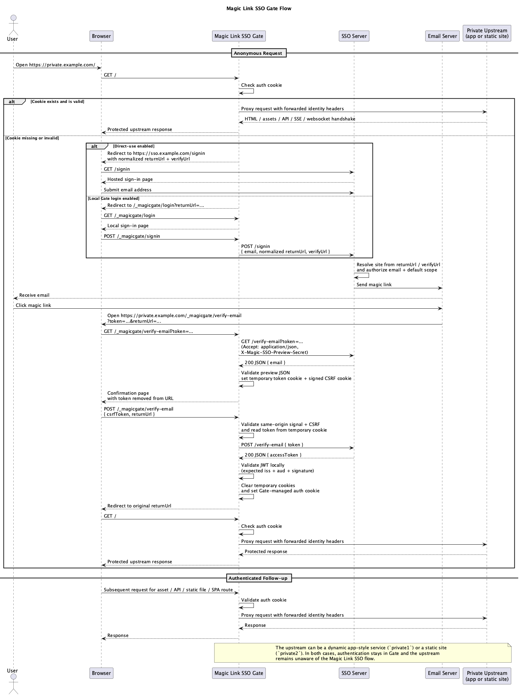

# Magic Link SSO Gate

Magic Link SSO Gate is the repository's answer for protecting arbitrary private
resources when the protected app cannot integrate directly with Magic Link SSO
or should stay completely unaware of the auth flow.

## What It Solves

Use Gate when:

- the protected app is fully CSR
- the protected app is static HTML or assets
- the protected app lives in an unknown framework
- you want to avoid HTTP Basic Auth
- you can place a programmable reverse proxy in front of the private upstream

Do not expose the upstream directly to the public internet. The protection only
holds if every request goes through Gate first.

## Request Flow

Production shape:

- `sso.example.com` -> Magic Link SSO server
- `private.example.com` -> Magic Link SSO Gate
- `private-upstream.internal` -> private app behind Gate

Flow:

1. The browser requests `https://private.example.com`.
2. Gate checks its own `httpOnly` cookie.
3. Anonymous document requests redirect to `/_magicgate/login` or straight to
   `https://sso.example.com/signin` when direct-use mode is enabled.
4. The hosted sign-in page sends the magic link email.
5. The email link returns to
   `https://private.example.com/_magicgate/verify-email?...`.
6. Gate previews the token with `GET /verify-email?token=...` and the shared
   `MAGICSSO_PREVIEW_SECRET`, then exchanges the one-time token with
   `POST /verify-email` on the SSO server.
7. Gate validates the returned JWT locally with `auth.jwtSecret`,
   `expectedAudience`, and `expectedIssuer`.
8. Gate stores its own auth cookie and redirects to the original `returnUrl`.
9. Authenticated traffic is proxied to the private upstream.

The dedicated Gate flow source diagram lives in
[`docs/MagicLinkSSO-Gate-Flow.puml`](./MagicLinkSSO-Gate-Flow.puml). It stays
separate from the main authentication flow diagram so the reverse-proxy model
remains readable on its own.

<picture>
  <source media="(prefers-color-scheme: dark)" srcset="./MagicLinkSSO_Gate_Flow_dark.png">
  <source media="(prefers-color-scheme: light)" srcset="./MagicLinkSSO_Gate_Flow_light.png">
  
</picture>

## Gate Namespace

Gate reserves `/_magicgate/*` by default so it does not collide with routes
owned by the upstream application.

Canonical endpoints:

- `GET /_magicgate/login`
- `POST /_magicgate/signin`
- `GET /_magicgate/verify-email`
- `POST /_magicgate/verify-email`
- `POST /_magicgate/logout`
- `GET /_magicgate/session`
- `GET /_magicgate/healthz`

Everything outside that namespace is a protected upstream route candidate.

## Production Example

For `private.example.com` plus `sso.example.com`, configure the SSO server like
this:

```toml
[[sites]]
id = "private"
origins = ["https://private.example.com"]
allowedRedirectUris = [
  "https://private.example.com/_magicgate/verify-email",
  "https://private.example.com/*",
]
allowedEmails = ["friend@example.com"]
```

Gate TOML:

```toml
[gate]
port = 4000
mode = "subdomain"
namespace = "/_magicgate"
publicOrigin = "https://private.example.com"
upstreamUrl = "http://private-upstream.internal:3000"
directUse = true
requestTimeoutMs = 10000
rateLimitMax = 240
# Optional: set rateLimitRedisUrl to share rate limits across gate replicas.
# rateLimitRedisUrl = "redis://redis:6379/0"
# rateLimitKeyPrefix = "magic-sso-gate"
rateLimitWindowMs = 60000
trustProxy = true
wsEnabled = true

[auth]
serverUrl = "https://sso.example.com"
jwtSecret = "replace-with-a-real-jwt-secret-at-least-32-chars"

[cookie]
name = "magic-sso"
path = "/"
maxAge = 3600
```

Copy [`gate/magic-gate.example.toml`](../gate/magic-gate.example.toml) to
`gate/magic-gate.toml`, update the values, and point `MAGIC_GATE_CONFIG_FILE` at
the copied file.

Recommended public routing:

- `sso.example.com -> magic-sso`
- `private.example.com -> magic-gate`
- `private-upstream.internal` reachable only from Gate or private networking

### Standalone Production Compose

When your Magic Link SSO server is already deployed, the repository ships a
standalone production compose example for Gate itself:

```sh
cp gate/magic-gate.example.toml gate/magic-gate.toml
cp gate/.env.prod.example gate/.env.prod
docker compose --env-file gate/.env.prod -f gate/docker-compose.prod.yml up -d
```

That example intentionally starts only Gate. It assumes:

- a `gate/magic-gate.toml` file is mounted into the container
- `MAGIC_GATE_CONFIG_FILE` points to that mounted file
- TLS termination and public host routing are handled outside the container

The published GHCR images are split by component under the full repository
namespace:

- `ghcr.io/magic-link-sso/magic-sso/server:latest`
- `ghcr.io/magic-link-sso/magic-sso/gate:latest`

This keeps the production Gate example standalone. You do not need to run the
SSO server inside the same compose project, and Gate reads every runtime value
from the TOML file instead of from env vars.

## Path Prefix Mode

Gate also supports path-prefix deployments such as
`https://example.com/private/...`.

Use:

```toml
[gate]
mode = "path-prefix"
publicOrigin = "https://example.com"
publicPathPrefix = "/private"

[cookie]
path = "/private"
```

That makes the canonical namespace:

- `https://example.com/private/_magicgate/login`
- `https://example.com/private/_magicgate/verify-email`

Path-prefix mode is intentionally documented with caveats:

- the upstream must support a base path
- asset URLs must not assume `/`
- SPA routers must know the basename
- websocket and SSE endpoints must stay reachable under the same prefix

If the upstream cannot run under a prefix, prefer a subdomain.

## Running Everything Locally

### Separate Processes

Run for `private1`:

```sh
pnpm dev:server
pnpm --filter example-app-gate-private1 dev
MAGIC_GATE_CONFIG_FILE="$PWD/gate/magic-gate.toml" pnpm dev:gate
```

Suggested local setup:

- copy `gate/magic-gate.example.toml` to `gate/magic-gate.toml`
- set `MAGIC_GATE_CONFIG_FILE="$PWD/gate/magic-gate.toml"`
- update the SSO server URL, JWT secret, and upstream origin in the TOML file

### Full Docker Stack

Run:

```sh
cp gate/.env.example gate/.env
docker compose --env-file gate/.env -f gate/docker-compose.yml up --build
```

That stack includes:

- Caddy as the public reverse proxy
- Magic Link SSO server
- Magic Link SSO Gate for `private1`
- Magic Link SSO Gate for `private2`
- `private1` dynamic upstream example
- `private2` static site example
- Mailpit for inspecting the magic-link email

Open:

- `http://private1.localhost:4306`
- `http://private2.localhost:4306`
- `http://sso.localhost:4306`
- `http://localhost:8025`

Mailpit lets you click the magic link without setting up a real SMTP service.
The bundled Docker stack renders dedicated TOML files for the SSO server and
each Gate instance before launch, with matching non-placeholder secrets for the
local stack. For `private2`, the dev compose stack bind-mounts the static
`public/` directory, so HTML/CSS/JS asset changes are reflected on refresh
without an image rebuild. The compose stack reads `gate/.env` only as bootstrap
input for the render step, so you can change public hosts, allowed emails, and
shared dev secrets in one place without touching `docker-compose.yml`. The Gate
renderer inputs are grouped under the `MAGIC_GATE_RENDER_*` prefix, including
`MAGIC_GATE_RENDER_SERVER_URL`, `MAGIC_GATE_RENDER_JWT_SECRET`,
`MAGIC_GATE_RENDER_COOKIE_NAME`, and `MAGIC_GATE_RENDER_COOKIE_MAX_AGE`. If you
use `pnpm dev:gate:stack`, Compose will still use defaults or exported shell env
vars. Use `docker compose --env-file gate/.env ...` when you want the stack to
read the env file explicitly.

The `private2` example is intentionally a static site behind Gate. It shows that
the protected upstream can be a plain file server for HTML, SPA bundles, and
assets with zero auth integration, SSR, or framework-specific code.

Treat [`gate/docker-compose.yml`](../gate/docker-compose.yml) as the local
development topology and
[`gate/docker-compose.prod.yml`](../gate/docker-compose.prod.yml) as the
standalone production deployment example for Gate.

## Forwarded Identity Headers

Gate forwards the authenticated identity to the private upstream with:

- `x-magic-sso-user-email`
- `x-magic-sso-user-scope`
- `x-magic-sso-site-id`

Treat those headers as trusted only when the upstream is reachable exclusively
through Gate.
